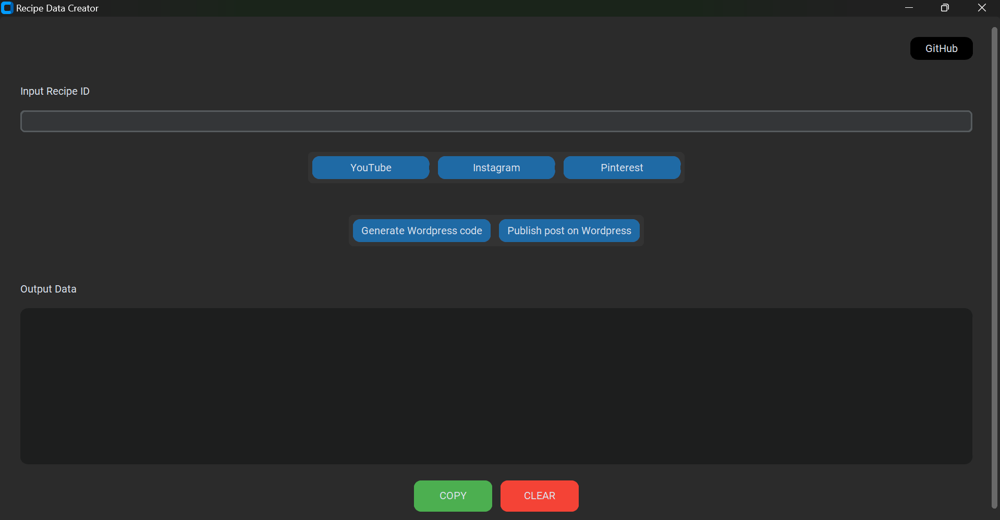
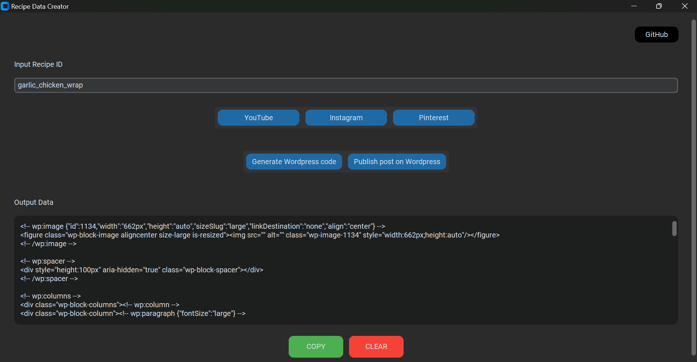
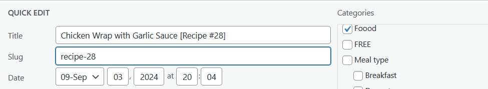
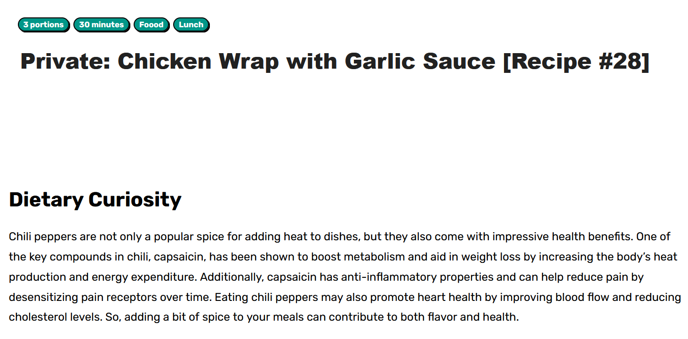
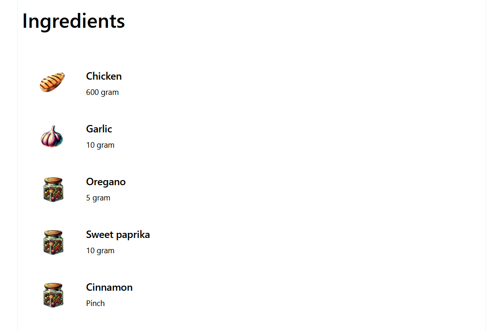
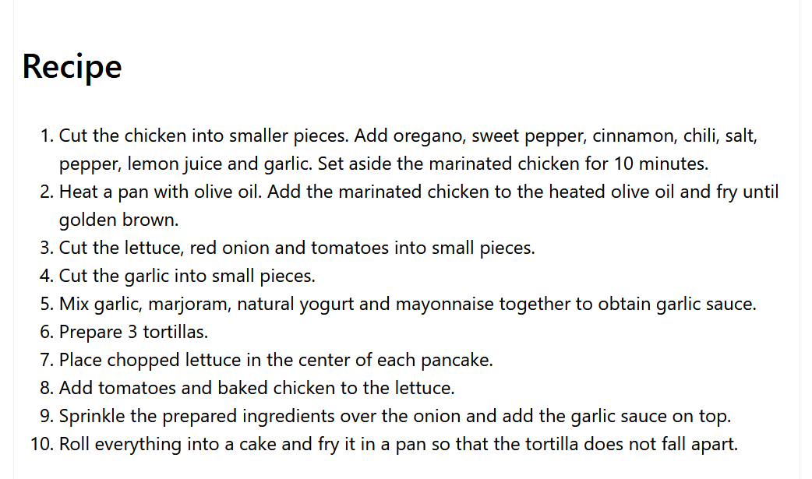
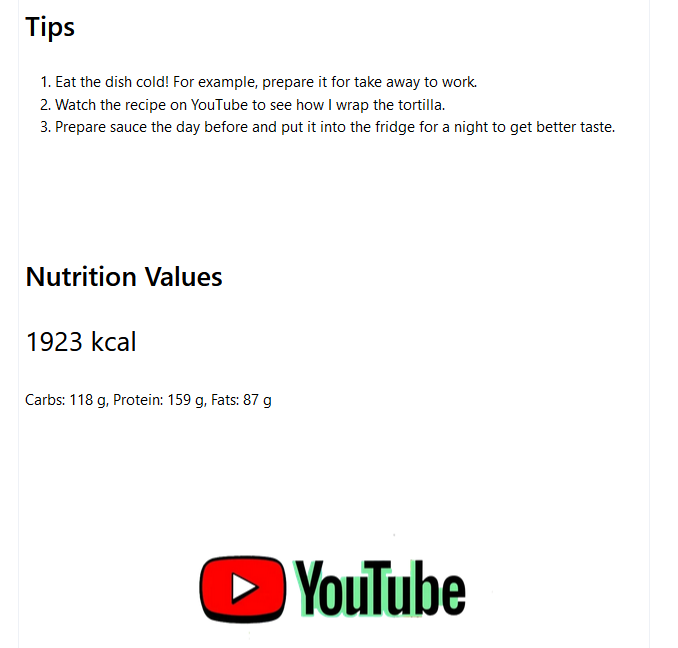

# APPLICATION UPDATING WEB DATA
## Objective
Support users in publishing data on WordPress and generate prompts for ChatGPT - prompt templates are intended to prepare descriptions for the platforms YouTube, Instagram, and Pinterest.

## Key results
1. Prepare prompts for YouTube, Instagram, and Pinterest based on templates (users must copy-paste prompts to ChatGPT because using API needs an extra fee so it is not included in this project).
2. Generate WordPress code which can be copy-paste to the WordPress application
3. Create an API to automatically publish posts on WordPress.
4. Example templates for prompts generator and WordPress code
5. Before every run automatic backup preparation in the indicated location

Main functionalities for web platforms:

| WordPress | YouTube | Instagram | Pinterest |
| ----------- | ----------- | ----------- | ----------- | 
| generate copy-paste code for posts based on templates | prompt for ChatGPT | prompt for ChatGPT | prompt for ChatGPT | 
| publishing new posts via API | - | - | - |
| ability to copy the entire code or its fragments from the UI level or separate text files | - | - | - |


## Content
- [App examples](./README.md#app-examples)
- [App settings](./README.md#app-settings)
- [How to run the app?](./README.md#how-to-run-the-app)
  - [Environment](./README.md#environment)
  - [Used technologies](./README.md#used-technologies)
  - [Run the app](./README.md#run-the-app)
- [License](./README.md#license)

## App examples









## App settings

1. Input data for the application are stored in an Excel file (the application converts data from an Excel file for temporary data tables on which you can later invoke SQL commands)
2. Every web application's data contains example templates that include specific strings of characters to replace data from the database (example: '_EXAPLE_STRINGS_TOREPLACE'). Example templates are located in the folder: ..\prepare_data\templates
3. Prepared data are saved in the output file and visible to the user in the main application window. The main output file is located in the folder: ..\prepare_data\output. Smaller pieces of code generated when preparing the final output file are located in the folder: ..\prepare_data\templates
4. Prepared data for WordPress could be used to create new posts via API or copy-paste manually

## How to run the app?
### Environment
- Windows 11 (the application has not been tested on any other environment)

### Used technologies
- Visual Studio Code
- Python
- JSON
- Excel
- Txt files
- WordPress REST API Authentication

### Run the app
Download files from GitHub
```
git clone https://github.com/FooodMoood/python-app_updating_web_data.git
```

Before using the app set you configuration in a files below:

| File path | Variable name |
| ----------- | ----------- | 
| ..\apis\config.py | wp_base_url |
| ..\apis\config.py | wp_username |
| ..\apis\config.py | wp_password |
| ..\prepare_data\config.py | yt_icon_url |
| ..\data\data-food.xlsx | sheet: ingredients, column: ingredient_wp_url |
| ..\data\data-food.xlsx | sheet: wp_categories, column: wp_id |

The application is launched from the app.py file.
The application is prepared to run locally on a private computer.

## License
[MIT license](https://opensource.org/licenses/MIT)

